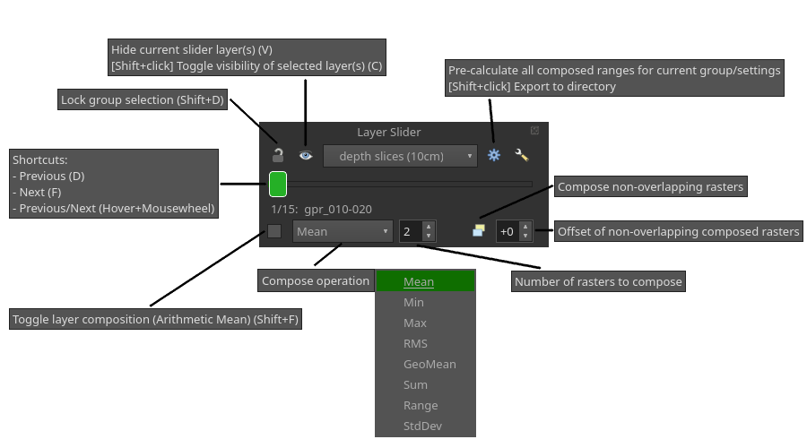

# Layer Slider – QGIS Plugin [](https://doi.org/10.5281/zenodo.19341475)

<p align="center">
  
</p>

**Layer Slider** is a [QGIS](https://qgis.org) plugin for navigating and composing ordered layers or layer groups with an intuitive slider, keyboard shortcuts, and dynamic layer compositing.
It is designed for any workflow where you need to flip through a sequence of layers — whether they represent increasing depth, successive points in time, or alternative visualizations of the same area.

Install directly via the [QGIS plugin repository](https://plugins.qgis.org/plugins/layer_slider/) or manually (see [below](#installation)). If you use Layer Slider in your academic work, please [cite it](#citing-layer-slider).

Developed by Maximilian Obermayer.
For collaboration and research- or software-related inquiries, visit my homepage [mobermayer.at](https://mobermayer.at).
For issues regarding the Layer Slider, please use the [issue tracker](https://github.com/mobermayer/layer-slider/issues).

## Demo
Basic demonstration with ground-penetrating radar depth slices:


https://github.com/user-attachments/assets/1ee1a25f-c6ae-4190-a5ee-4bfcf686bfbc

## Example use cases

- **Ground-penetrating radar (GPR):** Browse depth slices and dynamically compose combined slices of varying thickness.
- **Historical satellite & aerial imagery:** Step through time series of optical imagery to track change over years or decades.
- **DTM / DEM visualizations:** Switch between your calculated hillshade, sky-view, slope etc. from the same data.
- **Archaeological / geological / soil horizons:** Navigate vertical sequences of subsurface data at different depths.
- **Multi-temporal land cover & land use maps:** Compare classified maps across survey dates.
- **Climate & weather data:** Walk through monthly or seasonal rasters of precipitation, temperature, NDVI, etc.
- **Environmental monitoring:** Cycle through pollution concentration grids, flood extent snapshots, or ecological survey layers.
- **Urban change detection:** Review before/after layers for construction, demolition, or infrastructure projects.

## Usage
The functionality, is explained in each element's tooltip.
To show the widget, click on the plugin's icon in the plugins toolbar or under `Plugins > LayerSlider > Layer Slider - widget`.



Note that the individual layers must be inside a group in the QGIS layer tree.
This plugin provides an improved UI for interacting with these data, not the data themselves.
Compositing currently only works on local raster layers with the `gdal` provider (e.g. GeoTIFF) and outputs grayscale images.
Composed layers can be exported by `right-click > Export composed layer...` on the composed layer or `shift+click` on the pre-calculate button.

### Key features

| Feature | Description |
|---|---|
| **Slider navigation** | Drag a slider or use keyboard shortcuts to step through layers or groups instantly. |
| **Layer tree integration** | Works with any combination of individual layers and layer groups already in your QGIS project; no special file format required. |
| **Dynamic layer compositing** | Compute averaged **raster** composites on the fly (e.g. combine adjacent GPR depth slices into a thicker slice). |
| **Configurable range** | Choose the start and end layers/groups so the slider only covers the portion of the tree you care about. |
| **Caching** | Pre-calculated composites are cached to disk so repeated navigation is instantaneous. |
| **Export** | Export dynamic composites as GeoTIFF files from the context menu. |

### Keyboard shortcuts

Layer Slider registers the following actions in the QGIS shortcuts system, intended for the left hand on a QWERTZ keyboard and the right hand on a mouse.

| Action | Default key |
|---|---|
| Previous layer | `D` |
| Next layer | `F` |
| Toggle show current layer | `V` |
| Toggle visibility of selected layer in tree | `C` |
| Toggle lock layers | `Shift+D` |
| Toggle compose rasters | `Shift+F` |

All shortcuts can be customized (and unbound ones assigned) in `Settings > Keyboard Shortcuts…` and search for `Layer Slider`.

## Comparison to alternatives

### TiffSlider (QGIS plugin)

[TiffSlider](https://plugins.qgis.org/plugins/tiffslider/) while similar, it has significant limitations: limited to rasters, does not use the existing layer's visibility, modifies the layer's opacity, no compositing, interaction-blocking popup-window.

### GPR Depth Composer (ArcGIS)

GPR Depth Composer included in ArchaeoAnalyst is an ArcGIS toolset that can compute combined depth slices of varying thickness (see [Trinks et al. 2018, p. 20](https://onlinelibrary.wiley.com/doi/10.1002/arp.1599) for a short description). Layer Slider offers comparable compositing functionality, but runs inside QGIS (free & open-source) and works with arbitrary layer types (e. g. GeoTIFF rasters).

## Citing Layer Slider

If you use Layer Slider in your academic work, please cite it (or whichever version you use):

> Obermayer, M. (2026). Layer Slider – QGIS Plugin (v1.0.0). Zenodo. https://doi.org/10.5281/zenodo.19341476 . Available at https://github.com/mobermayer/layer-slider

A machine-readable [`CITATION.cff`](CITATION.cff) file is included in this repository and will be picked up automatically by GitHub and Zenodo.

## Installation

### From the QGIS Plugin Repository (recommended)

Install directly via the [QGIS plugin repository](https://plugins.qgis.org/plugins/layer_slider/) in QGIS. Search for `Layer Slider` in the QGIS plugin manager and install.

### Manual / development install

1. Download or clone this repository.
2. Symlink or copy the folder into your QGIS plugins directory.
   On Linux this is typically:
   ```
   ln -s /path/to/layer-slider ~/.local/share/QGIS/QGIS3/profiles/default/python/plugins/layer-slider-main
   ```
3. Restart QGIS and enable **Layer Slider** in *Plugins → Manage and Install Plugins*.

## Development

### Prerequisites

- QGIS 3.x (3.28 LTS or newer recommended)
- Python 3.10+ (ships with QGIS)
- No additional Python packages required — the plugin uses only the QGIS/Qt/GDAL libraries bundled with QGIS.

### Local setup

```bash
# Clone the repo
git clone https://github.com/mobermayer/layer-slider.git

# Symlink into your QGIS plugins directory
ln -s "$(pwd)/layer-slider" ~/.local/share/QGIS/QGIS3/profiles/default/python/plugins/layer-slider-main

# Restart QGIS, then enable the plugin in the Plugin Manager
```

### Build

```bash
./scripts/build.sh
# Output: release/layer_slider-<version>/layer_slider-<version>.zip
```

The version number is read from `metadata.txt`.

## Releasing a new version

Use this checklist so the plugin version, citations, and published artifacts stay in sync.

### 1. Version and changelog

- Bump `version=` in [`metadata.txt`](metadata.txt) (this value drives `./scripts/build.sh` and the QGIS Plugin Manager)
- Update [`CHANGELOG.md`](CHANGELOG.md) with version and contents
- Update `changelog=` line in [`metadata.txt`](metadata.txt) for QGIS plugin repository

### 2. Zenodo DOI and citations

Zenodo distinguishes a *concept DOI* (stable across all releases; good for README badges) from a version-specific DOI*.
Create a new version on Zenodo as a draft and copy its **version-specific DOI** (do not release it yet).
Update these places so the **version string**, **year**, and **DOIs** match what Zenodo and GitHub show:

- [`metadata.txt`](metadata.txt): `version=`, and the citation sentence inside the `about=` block (version, year, DOI URL)
- [`README.md`](README.md): version, year and DOI URL in [Citing Layer Slider](#citing-layer-slider)
- [`CITATION.cff`](CITATION.cff): `version`, `doi`, and `date-released`

### 3. Build

```bash
./scripts/build.sh
```

Confirm the ZIP under `release/layer_slider-<version>/` installs and runs in QGIS before you publish it.

### 4. Release
#### 4.1. GitHub release and tag
- Commit all version and citation changes on `main` (or release branch)
- create a **Release** from with a new tag, add release notes, and attach the built `layer_slider-<version>.zip` and `layer_slider-<version>.zip.md5`

#### 4.2. Zenodo
- Manually upload the same `layer_slider-<version>.zip` and `layer_slider-<version>.zip.md5` to the draft and publish the record

#### 4.3. QGIS plugin repository
- Upload the same `layer_slider-<version>.zip` to the [QGIS plugin repository](https://plugins.qgis.org/plugins/layer_slider/)

## Changelog

Release notes and version history are in [CHANGELOG.md](CHANGELOG.md).

## License

This plugin is free software licensed under the [GNU General Public License v3 (or later)](LICENSE).

See [LICENSE](LICENSE) for the full text.
